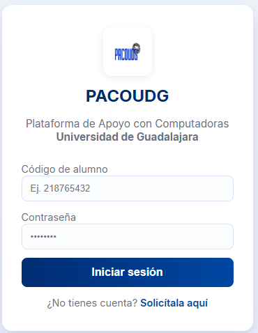
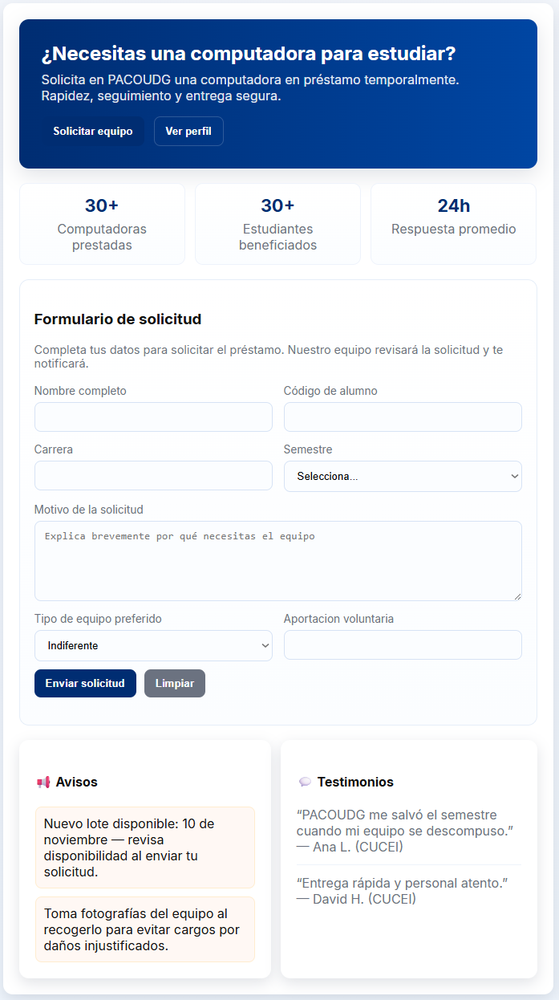
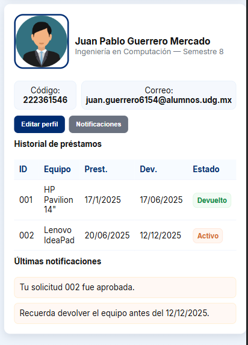

# 🎓 PACOUDG — Plataforma de Apoyo con Computadoras UdeG

**PACOUDG** (Plataforma de Apoyo con Computadoras de la Universidad de Guadalajara) es un sistema web diseñado para apoyar a los estudiantes que no cuentan con un equipo de cómputo propio, permitiendo solicitar en préstamo computadoras de manera temporal y controlada.

El proyecto busca **reducir la brecha tecnológica** dentro de la comunidad universitaria, promoviendo la igualdad de oportunidades y el acceso equitativo a recursos digitales.

Aun esta en fase prototipo.

---

## 🚀 Características principales

- 🌐 Interfaz web moderna e intuitiva.
- 👨‍🎓 Apartado de **perfil de alumno** con datos, historial y notificaciones.
- 💻 **Formulario de solicitud** de préstamo con validación de datos.
- 📊 Almacenamiento local (`localStorage`) para simular persistencia de información.
- 🔐 **Inicio de sesión** básico simulado con JavaScript.
- 🎨 Diseño inspirado en los colores institucionales de la **Universidad de Guadalajara**.
- 📱 Interfaz **responsive** (adaptable a móviles, tablets y computadoras).

---

## 🧩 Estructura del proyecto
PACOUDG/
│
├── index.html # Página principal de la plataforma
├── login.html # Página de inicio de sesión
├── style.css # Estilos principales (paleta UdeG)
├── /imagenes # Carpeta para íconos, logos o gráficos
└── README.md # Este archivo

---

## 🛠️ Tecnologías utilizadas

| Tecnología | Descripción |
|-------------|--------------|
| **HTML5** | Estructura base de la aplicación web |
| **CSS3** | Diseño visual, estilo institucional, transiciones y animaciones |
| **JavaScript (ES6)** | Lógica funcional, validaciones, simulación de almacenamiento local |
| **LocalStorage API** | Persistencia temporal de datos (sin base de datos real al ser un prototipo) |
| **React** | Utilización de componentes para la interfaz de usuario |
| **Django** | El encargado de conectar con la base de datos (en proceso) |

---

## 🧠 Arquitectura del sistema

El sistema está dividido en tres módulos principales:

1. **Inicio:** Presenta la descripción del proyecto, estadísticas y accesos directos.
2. **Solicitud:** Formulario para registrar una solicitud de préstamo con validación.
3. **Perfil:** Visualiza información del estudiante, historial y notificaciones.

---

## 📋 Requerimientos del sistema

- Navegador moderno (Google Chrome, Firefox, Edge)
- Conexión a internet (solo para visualización del repositorio)
- No requiere instalación ni base de datos (por el momento)

---

## 🧪 Pruebas realizadas

- ✅ Validación de formulario de solicitud  
- ✅ Almacenamiento y recuperación de datos en `localStorage`  
- ✅ Edición de perfil y visualización de historial  
- ✅ Responsividad en distintos dispositivos  
- ✅ Navegación fluida entre secciones  

---

## 📸 Capturas del sistema

| Inicio | Solicitud | Perfil |
|:--:|:--:|:--:|
|  |  |  |

---

## 🧾 Autores

**Juan Pablo Guerrero Mercado**  

Universidad de Guadalajara,
Centro Universitario de Ciencias Exactas e Ingenierías (CUCEI)  
Ingeniería en Computación — 8° semestre  

📧 *juan.guerrero6154@alumnos.udg.mx*

---

**Rodrigo Perez Renteria**

Universidad de Guadalajara,
Centro Universitario de Ciencias Exactas e Ingenierías (CUCEI)  
Ingeniería en Computación — 8° semestre  

📧 *rodrigo.perez5333@alumnos.udg.mx*

---

**Eder Isaac Acosta Sevilla**

Universidad de Guadalajara,
Centro Universitario de Ciencias Exactas e Ingenierías (CUCEI)  
Ingeniería en Computación — 8° semestre  

📧 *eder.acosta5649@alumnos.udg.mx*

---

## 📄 Licencia

Este proyecto es de **uso académico** y se distribuye bajo la licencia [MIT](https://opensource.org/licenses/MIT).

> Proyecto desarrollado como parte del **Módulo de Integración de Saberes — Proyecto Modular**, Universidad de Guadalajara, 2025.
